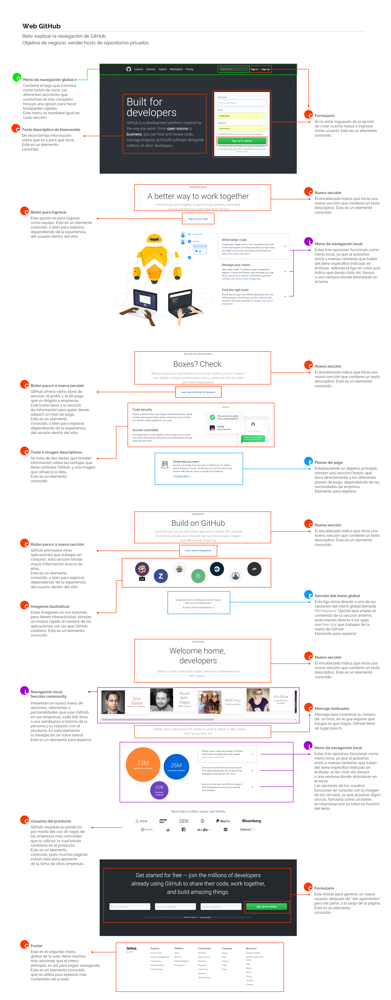
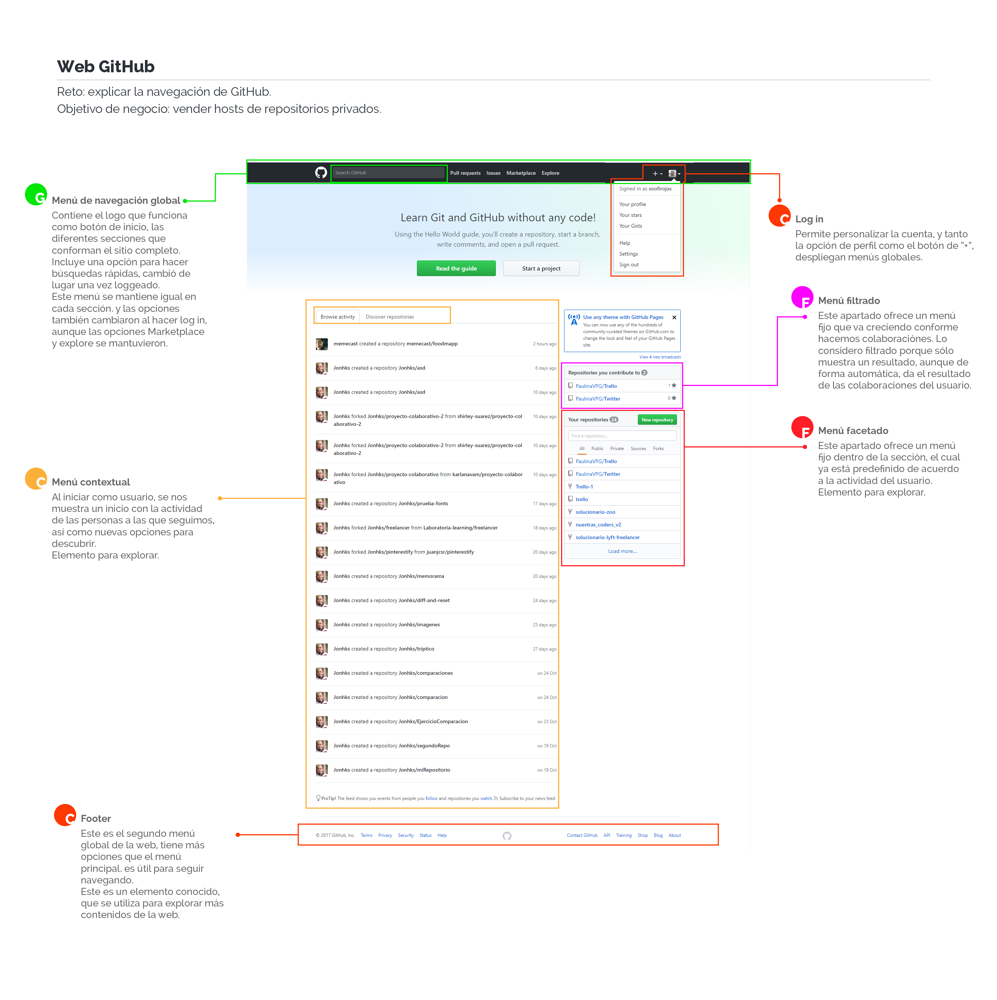

# Reto de código UX

**Laboratoria**
* Este reto se trata de describir tanto las partes del **UX** como del **UI** de http://www.laboratoria.la/.

Anexo la imagen del análisis, paso a paso de cada sección del inicio, así como un PDF para una mejor calidad de imagen.

**GitHub**
* Este reto se trata de describir los **elementos de navegación** de la web https://github.com/ .

Anexo la imagen del análisis, paso a paso de cada sección del inicio, tanto como nuevo usuario, como después de hacer log in. También adjunto un PDF para una mejor calidad de imagen.

* Inicio como nuevo usuario:

* Inicio haciendo log in:

